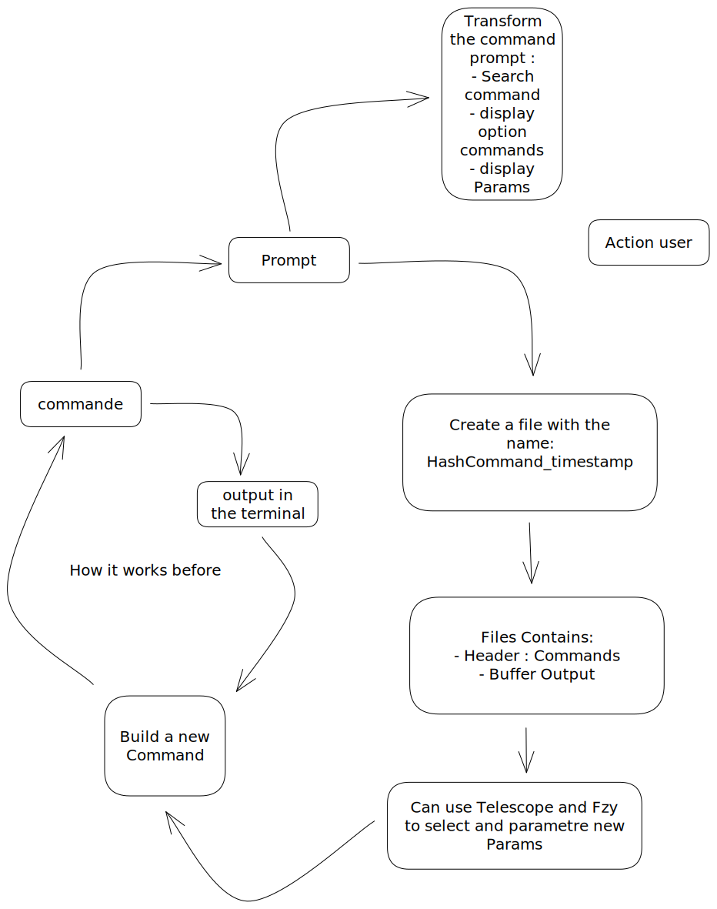

# f_seashell.nvim

Enhanced workflow in neovim

## ToDo

- Build command (use telescope to sort possible executable, options, variables)
- create a file with the output of the command in a specifique directory
    - allowing for search in buffer
    - the name of the files is a concatenation of the hash of the file and a timestamp
- create a registers that store variables from previous output (these variables should be modifiable)

## Shema

